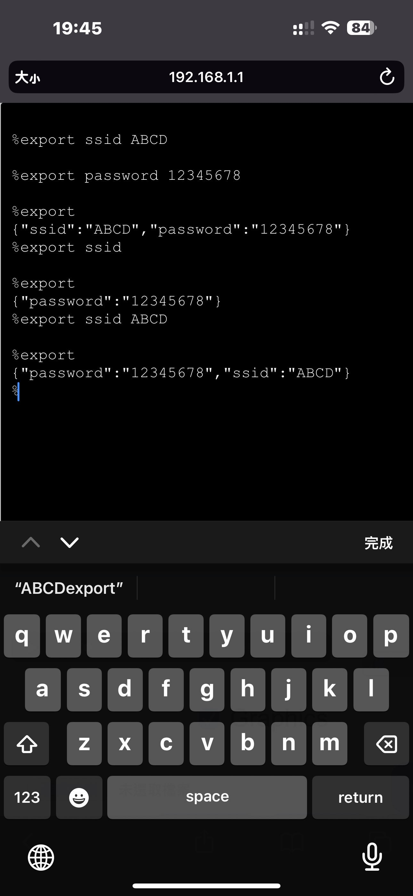
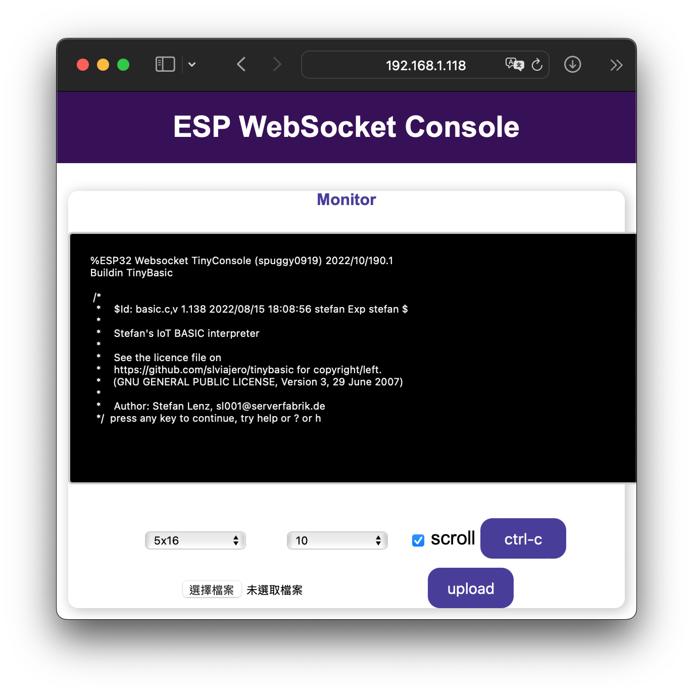
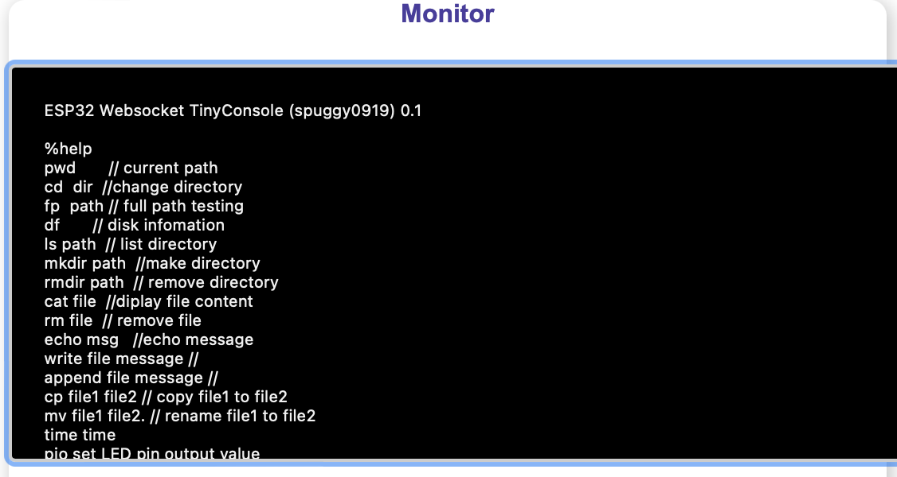
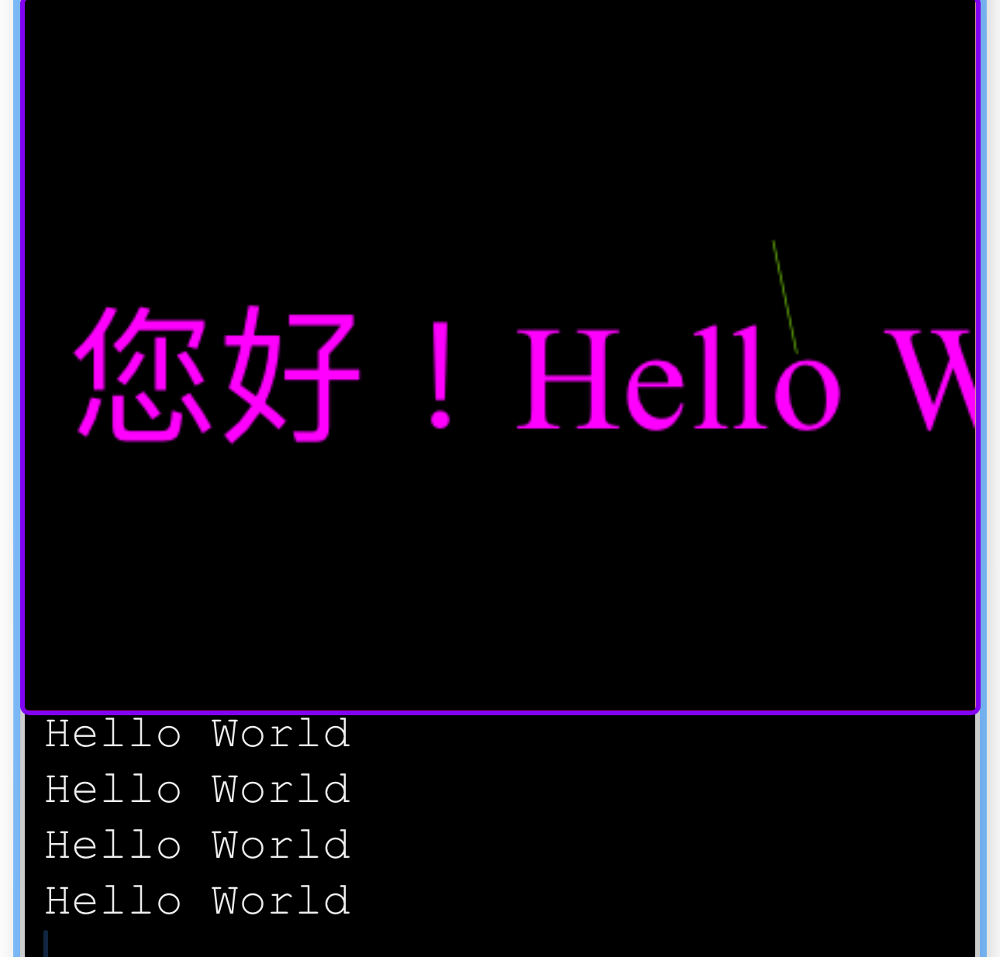

[中文](./讀我.md)
## ESP32 tinyConsole with TinyBasic or JerryScript
This firmware with web browser is a console, can upload, download, run TinyBasic on ESP32 board online. User can learn TinyBasic Language. 
ESP32 Web Server (tinyConsole) use me-no-dev/ESPAsyncWebServer, bases on WebSocket to implement bidirection serial port.

Now, JerryScript Interpreter is option. 

### Functions
  
1. browser LittleFS File System of ESP32.
2. upload or download file to File System.
3. You can use Phone APP, Pad App to edit program, then upload for running on ESP32 Board.
4. TinyBasic Program can be upload to LittleFS, and run by TinyBasic Interpreter.
5. TinyBasic with interactive mode, it can write program.
6. simple and tiny shell commands, ls, cat, cd, cp, append, rm, mkdir, help. But it is simple and no option operation, no wildcard filter.
7. add VGA graphics mode。
8. Wifi Config.json file setting, if delete config.json, then use AP mode, add mDNSfunction, use network utility scan to find ESP32 IP.
9. User define command in console, readme in CMD folder.
10. play (MP3)，Touch，Mouse Event is demo only。
TinyBasic is ported from slviajero/tinybasic. 
Currently, tinyConsole only supports DigitIO, Timer, FileIO, and WebSocket Serial IO.
11. mpi library support basic command to say hello
    
## TinyBasic LICENSE:

 [https://github.com/slviajero/tinybasic](https://github.com/slviajero/tinybasic) for copyright/left.

(GNU GENERAL PUBLIC LICENSE, Version 3, 29 June 2007)

## JerryScript LICENSE:
JerryScript library is modified from the  fork below
https://github.com/dmazzella/Arduino_Portenta_JerryScript

[libarary fork LICENSE MIT](https://github.com/spuggy0919/Arduino_Portenta_JerryScript/blob/main/LICENSE)
[JerryScript LICENSE Apache License 2.0](http://www.apache.org/licenses/LICENSE-2.0)

## TinyConsole base on following libraries and Platform. Thanks for them, and a lot of packages under these.
[espressif/arduino-esp32](https://github.com/espressif/arduino-esp32)
[me-no-dev/ESPAsyncWebServer](https://github.com/me-no-dev/ESPAsyncWebServer)
[fbiego/ESP32Time](https://github.com/fbiego/ESP32Time)
[Xander-Electronics/Base64](https://github.com/Xander-Electronics/Base64)
[slviajero/tinybasic](https://github.com/slviajero/tinybasic)
[U8g2](https://github.com/olikraus/U8g2_Arduino)
[Platform.io](https://platform.io)
[VSCode](https://code.visualstudio.com)
 
Don't be worried, platform.ini will auto download, no missing parts.

## Platform.IO IDE
 ESP32 is supported
 *Platform.io* will check dependency and download dependency libraries automatically.
 Tool bar at bottom , click Switch  env icon to select Project and env

### Either TINYBASIC or JERRYSCRIPT，modify /src/cmdconfig.h
```
// Language Config
// #define TINYBASIC    /* define TINYBASIC undef is  JERRYSCRIPT */
// #include "TinyBasic.h" // if not include the pio will not get dependency for lib

// need to add below into lib_dep of platform.ini
// then define JERRYSCRIPT and  #include "JerryScript_tc.h"
	// lib_dep = https://github.com/spuggy0919/Arduino_Portenta_JerryScript.git  ; javascript 
#ifndef TINYBASIC
#define _LANG_JERRYSCRIPT_ 
#include "JerryScript_tc.h"
#endif
```
#### For ESP32
```
Default(esp32_TinyConsole) folder*
```
### *Platform.ini* change serial port driver
enter Terminal（mac OS）
```
%ls /dev/cu*
/dev/cu.Bluetooth-Incoming-Port	/dev/cu.usbserial-0001
```
change ini statement to your driver number
```
upload_port = /dev/cu.usbserial-0001
```
#### For ESP8266 (maybe, but no timer function, it is not verified)<br>


### Build and Upload, need to push EN button.


#### *Important* upload binary file or data to file system, you must close serial monitor to let serial driver be free.

  In toolbar, (-> icon) can build and upload.
  for clean build, you can click clear icon, or delete *.pio* sub folder in explorer Window at first.
  After builded, the binary file can be upload from [>] terminal icon. Use below command.
  The path should be same with project path.
```
ESP32_TinyConsole % pio run -t upload [enter]
```
### *\data\config.json*,Wifi configures。
if let config empty or file not found, it will setup to AP mode.
The default AP name, ESPCONSOLE-XXXX, XXXX is mac address.
if you want STA wifi mode, modified config.json file, and uploadfs.
You also can set it in console mode, use export command.
```
{"ssid":"","password":""}
```
Or later use CONSOLE command "export" to setup to STA mode. For example, below SSID ABCD password 12345678
**NOTICE** config.json should be located at root directory, before export, make sure your working directory.

```
%cd /                       // check it is root
/
%export ssid ABCD           // set SSID
%export password 12345678   // set password
%export                     // get settings
```

### AUTORUN
In config.json, use autorun Key to replace Interpreter, you can customize power on, system default check "autoexec.bas" for tinybasic or "index.js" for Jerryscript, or use config autorun key。
```
// for Tinybasic 
%export autorun "tb /basic/autoexec.bas" // run basic use absolute path
// for Tinybasic 
%export autorun "js /js/41graphics.js"   // js start up run scripts
%export                                  // view exports
```
setup autorun key, user can select and execute the startup program, at /js/examples has a startup example, user can check websocket connect and wait esp32 boot, run a index.js program.
copy config.json to root, copy index.js to /js, then reset esp32. 

# upload file system, and need to push EN button.
 It will upload data folder to partition SPIFFS, it is OK.
 Click the pio tool bar terminal icon, then cli terminal will display, make sure path with your data then run command in terminal.
```
ESP32_TinyConsole % pio run -t uploadfs [enter]
```

### Running, click serial Monitor (plug icon) and reset button of ESP32 will display below Messages
```
Web Control
PWM init...done!
WiFiSTA() AutoMode 
WiFiSTAStatic(ssid SSID,pwd PASSWORD,ip, gw ) 
if ip and gateway is null then Auto Sta mode
Config as auto IP
Connecting to WiFi...
..192.168.1.118
stdioRedirector
WebServerGPIOControl Starting...
```


###  Login Console, Copyright Notices.


###  Key in help enter, these command are simple, case sensitive, and still awkward.
```
%help [enter]
```

####  upload, click Select file button then dialog show up, file selected, click Upload button.
####  dl file for download file to client。
```
%dl hello.bas [enter]
```
### Shell instructions 
#### TINYBASIC
Run TinyBasic interpreter, use "TinyBasic" or "tb", then '>' in Tinybasic Interactive mode.
```
%TinyBasic hello.bas [enter] // interactive mode use TinyBasic
```
```
%tinyBasic hello.bas [enter]
Hello World
>list
10 REM "The inevitable Hello World"
100 PRINT "Hello World"
> save "h.bas" 
> new
> load "blinkwod.bas"   // blink basic example for ESP32 
> run                   // press '#' for break running loop
>Crtl-C                 // press 'Crtl-C ' back to tinyConsole prompt '%' shell mode
%
%avtest [enter]         // internal command for graphics demo
%cd basic [enter]       // emtering BASIC sub directory
%tinyBasic v.bas [enter]// BASIC draw circles demo
>list [enter]           // emter BASIC interactive mode，list basic source code
>20 [enter]             // delete line #20
>RUN [enter]            // run text mode drawing demo
>SAVE "v1.bas"          // save as v1.bas
[ctrl-c]                // back to command shell mode
%cat v1.bas             // list file content
```
ESP32 SSD1306 Pin 21 SDA, Pin 22 SDL, Vcc 3.3V, GND, run
graphics mode compiler define is HTTPWSVGA，if you want use must change to ARDUINOSSD1306 in
hardware-arduino-HTTP.h
```
#define ARDUINOSSD1306 /*spuggy0919*/
#undef HTTPWSVGA /*spuggy0919  vga bai http winsocket*/
```
```
%tb SSD1306.bas  // or in TinyBasic use Load "SSD1306.bas"
```
Blink example
```
%tb blinkwod.bas
```
#### JERRYSCRIPT
```
%cd js
%ls                 // list all example
% js 0time.js       // run js file Date object
% je [enter]        // JS REPL mode
```

## Demo & graphics



[Demo](https://youtu.be/75JKm-M19pE)

#### TinyConsole built in TinyBasic, I have not run all examples yet!

Remember to modify Pin definition for ESP32, some examples are for Arduino.
for example LED pin 2 , EN button pin 0, and ESP32 3.3V.

[TinyBasic src](https://github.com/slviajero/tinybasic)

[TinyBasic Examples](https://github.com/slviajero/tinybasic/tree/main/examples)

## TinyBasic manual
[TinyBasic Manual](https://github.com/slviajero/tinybasic/blob/main/MANUAL.md)

## Good Luck！ 

[Back to top](#top)