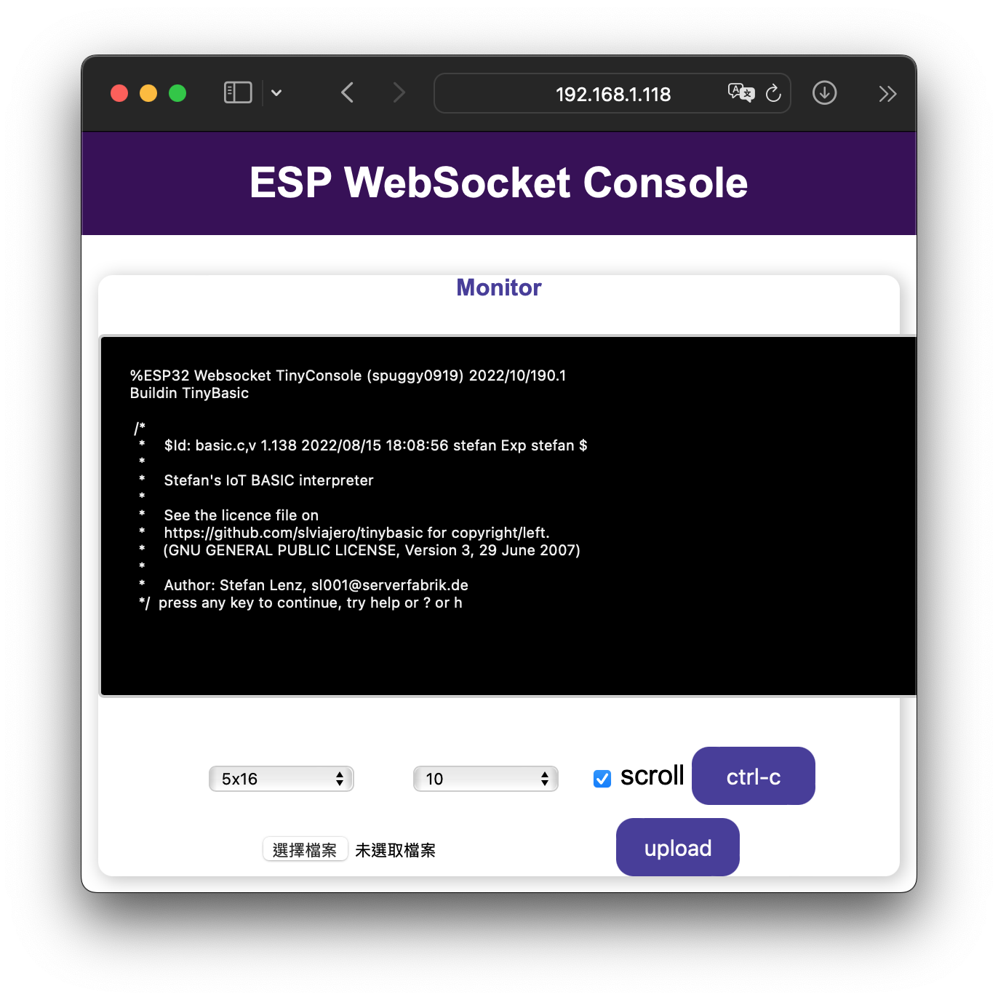
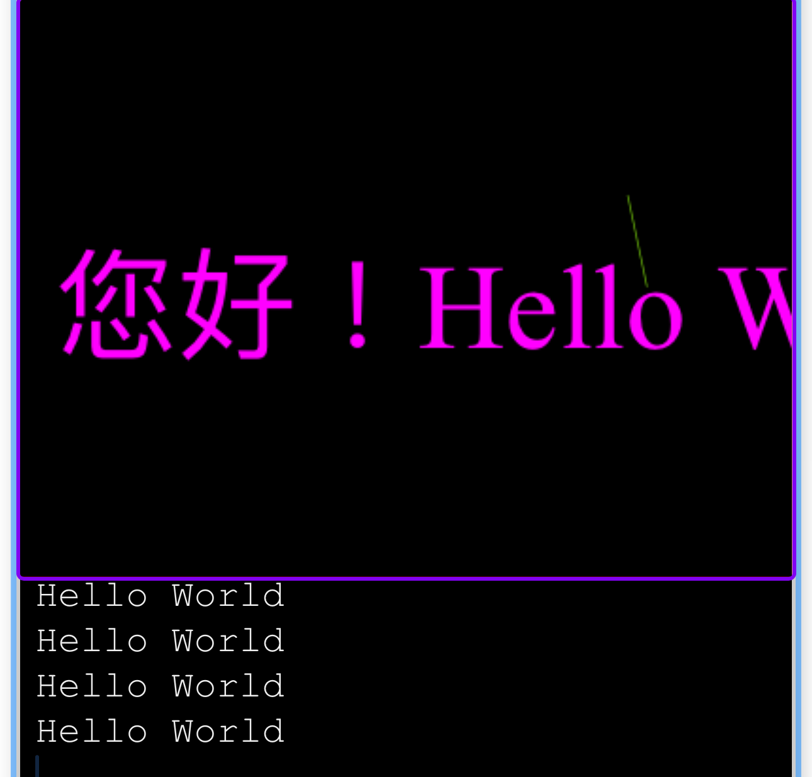

[English](./README.md)
## ESP的小終端機
透過瀏覽器配合ESP安裝此韌體,經由WebSocket達到如終端機般執行TinyBasic程式。
功能（這個專案可以學習TinyBASIC撰寫）。
除了TinyBASIC，增加一個語言選項JerryScript，必須在Compiler時決定。

1. 對檔案系統瀏覽目錄及查看檔案內容。
2. 由瀏覽器對ESP32上的檔案系統上傳或下載檔案。
3. 利用手機平板或電腦上利用編輯APP，撰寫TinyBasic程式。
4. TinyBasic程式，上傳到ESP32上的檔案系統，內建的TinyBasic或Jerryscript直譯器可檔案執行。
5. TinyBasic程式交談互動模式也可直接寫程式，執行存入檔案系統。
6. 簡配版的Shell指令集，沒有＊過濾沒有選項(-)。使用help, h, ? 查詢。
7. 增加繪圖VGA功能。
8. Wifi由Config.json設定，增加mDNS功能，方便用SCAN查找IP。
9. 增加擴充指令機制，參考cmd目錄
10. 播放音樂(MP3)，Touch，Mouse Event仍在開發中。
11. MPI hello 範例
    
TinyBasic直譯器從下移植過來，原來連結有使用手冊及範例。
目前本終端機僅有簡單IO, Timer, FileIO, SSD1306 及WebSocket串列IO。

## TinyBasic 版權說明:

 [https://github.com/slviajero/tinybasic](https://github.com/slviajero/tinybasic/blob/main/LICENSE) for copyright/left.

(GNU GENERAL PUBLIC LICENSE, Version 3, 29 June 2007)

## JerryScript 版權說明:
JerryScript is modifed from the  fork below
https://github.com/dmazzella/Arduino_Portenta_JerryScript

[libarary license MIT](https://github.com/spuggy0919/Arduino_Portenta_JerryScript/blob/main/LICENSE)
[JerryScript LICENSE Apache License 2.0](http://www.apache.org/licenses/LICENSE-2.0)

## TinyConsole 基於下列程式庫集平台，感謝他們（包含底層未提及的程式庫）。
[espressif/arduino-esp32](https://github.com/espressif/arduino-esp32)
[me-no-dev/ESPAsyncWebServer](https://github.com/me-no-dev/ESPAsyncWebServer)
[fbiego/ESP32Time](https://github.com/fbiego/ESP32Time)
[Xander-Electronics/Base64](https://github.com/Xander-Electronics/Base64)
[slviajero/tinybasic](https://github.com/slviajero/tinybasic)
[U8g2](https://github.com/olikraus/U8g2_Arduino)
[Platform.io](https://platform.io)
[VSCode](https://code.visualstudio.com)


## *Platform.IO*  開發平台
 支援ESP32微處理器
 網站伺服器程式庫使用 me-no-dev/ESPAsyncWebServer
 *Platform.io* 會自行下載核心庫集，沒有的才需要宣告並自動幫下載。
 底部工具條，點擊環境設定，選項會在上方顯示選單，選擇要編譯的環境設定，

## 如何編譯
#### 選定語言TINYBASIC或JERRYSCRIPT，修改/src/cmdconfig.h，這個檔案的內容可以選tinyConsole編譯的架構，第一部分是語言選項可以選TINYBASIC或JERRYSCRIPT或兩者皆不選，不選時可以仍保留第二部分簡單的SHELL指令機制，這個Simple Shell是以'%'作為提示字元。語言的提示字元均為'>'。
語言選項中主要是程式庫的載入，這部分是編譯的時候就載入會佔用FLASH ROM，所以使用者是需要或相依的程式庫再載入。SHELL指令會保留少部分，可參照/AAA/COMMAND.cpp，可選定的部分也請定義以省空間。

```
// Language Config
// #define TINYBASIC    /* 打開此為TINYBASIC 無定義視為 JERRYSCRIPT */
// #include "TinyBasic.h" // if not include the pio will not get dependency for lib

// need to add below into lib_dep of platform.ini
// then define JERRYSCRIPT and  #include "JerryScript_tc.h"
	// lib_dep = https://github.com/spuggy0919/Arduino_Portenta_JerryScript.git  ; javascript 
#ifndef TINYBASIC
#define _LANG_JERRYSCRIPT_ 
#include "JerryScript_tc.h"
#endif
```
#### ESP32 點選
```
Default(esp32_TinyConsole) folder*
```

#### *Platform.ini*   修改序列埠
可以在終端機查找（mac OS）
```
%ls /dev/cu*
/dev/cu.Bluetooth-Incoming-Port	/dev/cu.usbserial-0001
```
#### 更改ini
```
upload_port = /dev/cu.usbserial-0001
```
##### ESP8266 暫時不支持，可能可以沒試過

#### 編譯及上傳, 上傳ESP板子時要按下板子上EN按鍵。
##### *注意* 上傳燒錄ESP程式或資料一定要記得關掉串列監視器，以免驅動程式被佔據無法開啟。


  按pio工具列中的Upload ->圖標可以編譯及上傳。
  清除舊的編譯，可以按pio工具列中的垃圾桶或刪除目錄列視窗中的*.pio* 子目錄（PIO存放編譯過程產生的暫存檔）。編譯過後[>]也可以下指令直接燒錄。
```
ESP32_TinyConsole % pio run -t upload [enter]
```
#### **config.json**，修改Wifi設定連線。
不改會以AP模式無密碼連線。
修改\data\config,如果沒有設定會自動以AP模式沒有密碼開機,若Config設定正確會以STA_AUTO模式設定
```
{"ssid":"","password":""}
```
或連線後再CONSOLE以export上修改，如下會連上ssid ABC，password 12345678，
**注意** config.json 必須放在根目錄。
```
%cd /                       // 根目錄
/
%export ssid ABCD           // 設定SSID
%export password 1234567    // 設定密碼
%export                     // 查看設定
```
## AUTORUN
config.json支持AUTORUN Key，可以用autorun取代Interpreter，執行客製化開機，系統默認autoexec.bas及index.js為開機執行檔。
```
// for Tinybasic 
%export autorun "tb /basic/autoexec.bas" // 設定SSID
// for Tinybasic 
%export autorun "js /js/start.js"  // 設定js start up run scripts
%export                            // 查看設定
```
/data/js/example 有下列範例，可以將config.json拷貝至/data目錄，index.js 放在/data/js目錄後上傳資料開機，會執行index.js，會偵測Websocket是否連接，有無密碼然後顯示執行指令參數。(**MPI要取消偵測Websocket，這阻擋執行迴路**)
```
"autorun":"js /js/index.js 123 abc \"中文 字串\" def"
```


#### 上傳data目錄資料，要按下板子上EN按鍵。
 點擊pio底部工具列終端機圖標打開終端機[>]，注意終端機路徑必須是對應專案的路徑。

```
ESP32_TinyConsole % pio run -t uploadfs [enter]
```
#### 按下pio工具列中的(插頭圖標）序列監視器執行程式，或接著按開發板重置按鍵，會看到下列輸出訊息。
```
Web Control
PWM init...done!
WiFiSTA() AutoMode 
WiFiSTAStatic(ssid SSID,pwd PASSWORD,ip, gw ) 
if ip and gateway is null then Auto Sta mode
Config as auto IP
Connecting to WiFi...
..192.168.1.118
stdioRedirector
WebServerGPIOControl Starting...
```
## 用電腦或手機瀏覽器（必須連相同區網）拜訪網址 
```
http://192.168.1.118

```
##  登入版權說明頁


##  輸入 help enter, 目前指令可以短打，頭兩個字母。
```
%help [enter]
%avtest [enter] 內建指令 畫圖及播放音樂
%cd basic [enter] 進入BASIC目錄
%tinybasic v.bas [enter] BASIC 畫圓
>list [enter]  進入BASIC交談模式，看BAS源碼
>20 [enter]   刪除行號20
>RUN [enter]  文字模式顯示
>SAVE "v1.bas" 存檔
[ctrl-c] 回指令模式
%cat v1.bas 顯示源碼

```

####  上傳按選擇檔案，然後按Upload。
####  下載用 dl 指令。
```
%dl file [enter]
```
## TINYBASIC
####  執行TinyBasic指令。打 "TinyBasic" 或 "tb" 會由終端機 "%" 進入直譯器模式 ">"。
```
%TinyBasic hello.bas [enter]  // 載入 hello.bas 進入 TinyBasic 直譯器模式 ">"
```
```
%tinybasic hello.bas [enter]
Hello World
>list
10 REM "The inevitable Hello World"
100 PRINT "Hello World"
> save "h.bas" 
> new                   // 清除程式 重新撰寫程式
> load "blinkwod.bas"   // 載入 blink 閃LED ESP32
> run                  // 按 '#' 可以中斷執行迴圈中跳出
>Crtl-C                 // 按 'Crtl-C ' 回到終端機模式 ％
%

```
ESP32 SSD1306 Pin 21 SDA, Pin 22 SDL, Vcc 3.3V, GND, run
目前graphics mode編譯選項為HTTPWSVGA，若要執行SSD1306範例必須更換為ARDUINOSSD1306
hardware-arduino-HTTP.h
```
#define ARDUINOSSD1306 /*spuggy0919*/
#undef HTTPWSVGA /*spuggy0919  vga bai http winsocket*/
```
```
%tb SSD1306.bas  // or in TinyBasic use Load "SSD1306.bas"
```
Blink example
```
%tb blinkwod.bas
```

## JERRYSCRIPT
```
%cd js
%ls                 // list all example
% js 0time.js       // run js file Date object
% je [enter]        // JS REPL mode
```

## 示範影片及圖片



[示範影片](https://youtu.be/75JKm-M19pE)

### 感謝下列套件
[ESPAsyncWebServer](https://github.com/me-no-dev/ESPAsyncWebServer)

[LittleFS](https://www.arduino.cc/reference/en/libraries/littlefs_esp32/)

[TinyBasic程式源碼](https://github.com/slviajero/tinybasic)

[TinyBasic範例](https://github.com/slviajero/tinybasic/tree/main/examples)

#學習TinyBasic必看使用手冊
[TinyBasic使用手冊（英文）](https://github.com/slviajero/tinybasic/blob/main/MANUAL.md)

## 祝好運！

## [回頂部](#)
